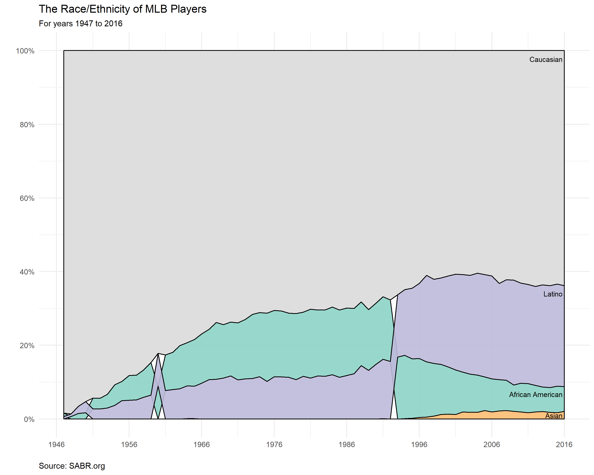

<h3> Makeover Monday: Feb 05, 2018 </h3>

<h3> Comments </h3>

For this week's Makeover Monday, I came across Yanning Wang's elegant [area bump chart](https://public.tableau.com/profile/yanning.wang#!/vizhome/MM2018Week6/YW), and I decided to (mostly) recreate the chart in R. A quick google search did not yield satisfactory results for an R package that could make this type of chart, so I decided to implement it myself (the resulting plot is displayed above and the code is below).

Overall, I'm happy with plot. I like that it shows the relative proportions of each race/ethnicity, but also places them in order so that we can see that Latinos have become the second leading ethnicity in the league.

<h3> Code </h3>

```{r code, echo=TRUE, eval=FALSE}
# libraries ----
library(data.world)
library(dplyr)
library(ggplot2)
library(scales)


# data ----

# datasets are referenced by their URL or path
dataset_key <- "https://data.world/makeovermonday/2018-w-6-baseball-demographics-1947-2016"

# list tables available for SQL queries
tables_qry <- data.world::qry_sql("SELECT * FROM Tables")
tables_df <- data.world::query(tables_qry, dataset = dataset_key)

if (length(tables_df$tableName) > 0) {
  sample_qry <- data.world::qry_sql(sprintf("SELECT * FROM `%s`", tables_df$tableName[[1]]))
  sample_df <- data.world::query(sample_qry, dataset = dataset_key)
}


# data preparation ----

# turn ethnicity into a factor
sample_df$ethnicity <- factor(sample_df$ethnicity)

# reorder the data to group by year 
sample_df <- sample_df %>% group_by(as.factor(year)) %>% arrange(ethnicity, .by_group = TRUE)

# gets the cumulative sum of percentage in order from least to greatest
csort <- tapply(sample_df$of_players, sample_df$year, function(x) cumsum(sort(x)))

# gets the rank of each of the races in terms of the percentage
erank <- rep(list(c(0,0,0,0)), length(csort))
for(k in 1:70){
  year_data <- sample_df %>% filter(year == (1946+k))
  erank[[k]] <- rank(year_data$of_players, ties.method = "first")
}

# need data as polygons, so I created this function
rpolygon <- function(r = 1){
  
  # need to find the rank of race percentage for each year
  position <- numeric(length(csort))
  for(i in 1:length(csort)){
    position[i] <- erank[[i]][r]
  }
  
  # gets the upper bound of the cumulative sum
  upper_bound <- numeric(length(csort))
  for(j in 1:length(csort)){
    if(position[j] == 4){
      upper_bound[j] <- 1.0 # need to specify because not all years add to 1
    } else {
      upper_bound[j] <- csort[[j]][position[j]]
    }
  }
  # gets the lower bound of the cumulative sum
  lower_bound <- numeric(length(csort))
  for(j in 1:length(csort)){
    
    if(position[j]- 1 < 1){
      lower_bound[j] <- 0 # need to specify so I don't get out of range
    } else {
      lower_bound[j] <- csort[[j]][position[j]-1]
    }
  }
  
  # return points of polygon as data frame
  data.frame(category = r,
             x = c(1947:2016, 2016:1947, 1947), 
             y = c(lower_bound, rev(upper_bound), lower_bound[1]))
}

# get polygons for different categories
df1 <- rpolygon(1) # African American
df2 <- rpolygon(2) # Asian
df3 <- rpolygon(3) # Latino
df4 <- rpolygon(4) # Caucasian

# create unified dataset, remove others
df <- rbind(df3, df2, df1, df4)
df$category <- factor(df$category, levels = c("1", "2", "3", "4"))
rm(df1, df2, df3, df4)


# Area Bump Plot ----

# colors for plot 
colors <- c("1" = adjustcolor("#8dd3c7", 0.9),
            "2" = adjustcolor("#fdb462", 0.8), 
            "3" = adjustcolor("#bebada", 0.9), 
            "4" = "gray87")

# created this data frame to place labels directly on plot
label_df <- data.frame(Race = c("African American", "Asian", "Latino", "Caucasian"),
                       x = rep(2015.75, 4), 
                       y = c(0.067, 0.01, 0.34, 0.977))

ggplot(df, aes(x, y)) +
  geom_polygon(aes(group = category, fill = category), col = "black") +
  scale_fill_manual(values = colors) +
  scale_x_continuous(name = "", breaks = seq(1946, 2017, 10)) +
  scale_y_continuous(name = "", breaks = seq(0, 1, 0.2), labels = percent) +
  ggtitle("The Race/Ethnicity of MLB Players", 
          subtitle = "For years 1947 to 2016") +
  guides(fill = FALSE) +
  theme_minimal() +
  theme(axis.title.x = element_text(hjust=0.015),
        axis.title.y = element_text(hjust=0.95)) +
  geom_text(data = label_df, aes(x, y, label = Race), size = 3, hjust = 1)
```