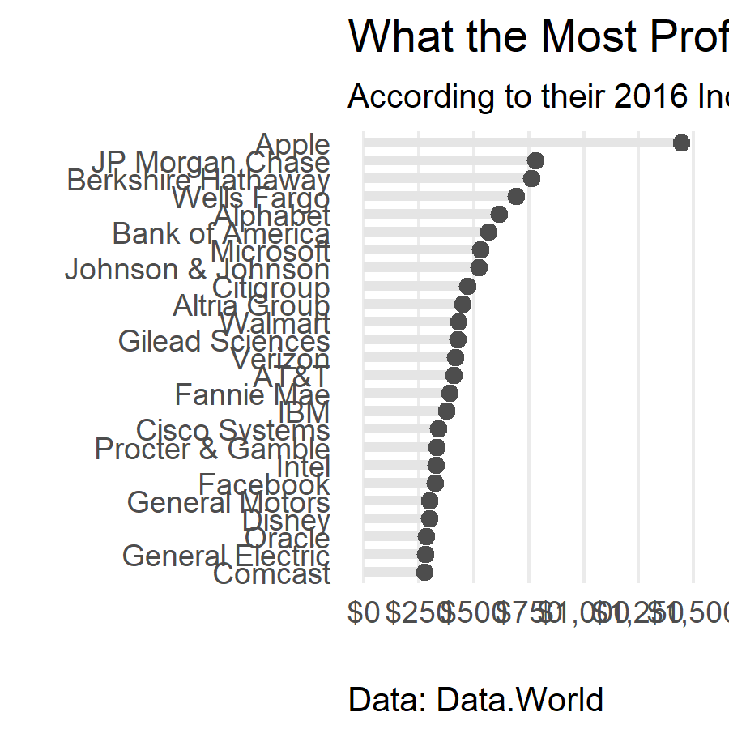

<h3> Makeover Monday: Jan 29, 2018 </h3>

<h3> Comments </h3>

For this week's Makeover Monday, I created a dot plot. I'm a big fan of dot plots; they are simple to make, clear to the audience, and have an elegant feel.

<h3> Code </h3>

```{r code, echo=TRUE, eval=FALSE}
# libraries ----
library(data.world)
library(dplyr)
library(ggplot2)
library(scales)


# data import ----

# Datasets are referenced by their URL or path
dataset_key <- "https://data.world/makeovermonday/2018-w-5-what-the-most-profitable-companies-make-per-second"
# List tables available for SQL queries
tables_qry <- data.world::qry_sql("SELECT * FROM Tables")
tables_df <- data.world::query(tables_qry, dataset = dataset_key)

if (length(tables_df$tableName) > 0) {
  data_qry <- data.world::qry_sql(sprintf("SELECT * FROM `%s`", tables_df$tableName[[1]]))
  dat <- data.world::query(data_qry, dataset = dataset_key)
}


# data preparation ----

# get order of companies by profit_second
ord <- dat %>%
  arrange(profit_second) %>%
  select(company)

# assign order to variable
dat$company <- factor(dat$company, levels=ord$company)

# create starting point for each "bar"
dat2 <- dat
dat2$profit_second <- 0
dat3 <- rbind(dat, dat2)


# plot ----

# dot plot
ggplot(dat3, aes(company, profit_second)) + # `2016_net_income`
  geom_line(aes(group = company), col = "gray90", size = 1.4) +
  geom_point(data = dat, aes(company, profit_second), size = 2, col = "gray30") +
  scale_y_continuous("",
                     breaks = seq(0, 1500, 250),
                     limits = c(0, 1500),
                     label = dollar) +
  ggtitle("What the Most Profitable Companies Make per Second",
          subtitle = "According to their 2016 Income Figures") +
  labs(x = "",
       caption = "Data: Data.World") +
  coord_flip() +
  theme_minimal() +
  theme(panel.grid.minor.x = element_blank(),
        panel.grid.major.y = element_blank(),
        plot.caption = element_text(hjust = 0))
```