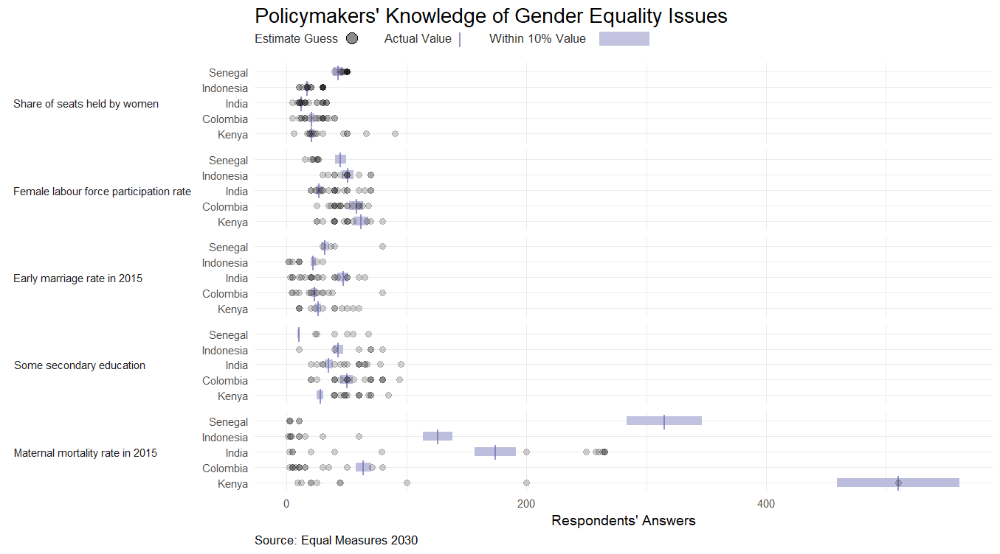

---
output:
  html_document: default
---

{width=100%}

<h3> Makeover Monday: Feb 26, 2018 </h3>

<h3> Comments </h3>

This week's Makeover Monday dataset was pretty challenging. I couldn't really find a good way to display the data myself, so I tried to emulate David Hoskins [visualization](https://public.tableau.com/profile/hoskerdu#!/vizhome/EqualMeasures2030PolicymakersandGenderEquality/Dashboard). I didn't get to recreate the whole thing, mostly because I didn't have more time. 

<h3> Code </h3>

```{r code, eval=FALSE, echo=TRUE}
# libraries ----
library(data.world)
library(dplyr)
library(ggplot2)
library(grid)


# data ----
# Datasets are referenced by their URL or path
dataset_key <- "https://data.world/makeovermonday/w102018-what-policymakers-know-about-women-and-girl-issues"
# List tables available for SQL queries
tables_qry <- data.world::qry_sql("SELECT * FROM Tables")
tables_df <- data.world::query(tables_qry, dataset = dataset_key)

if (length(tables_df$tableName) > 0) {
  data_qry <- data.world::qry_sql(sprintf("SELECT * FROM `%s`", tables_df$tableName[[2]]))
  prelim_data <- data.world::query(data_qry, dataset = dataset_key)
}


# data preparation ----
dat <- prelim_data %>%
  filter(estimate_guess != 10000) %>%
  mutate(lower_bound = correct_answer - (correct_answer*0.1),
         upper_bound = correct_answer + (correct_answer*0.1))

correct <- prelim_data %>%
  group_by(country, topic) %>%
  distinct(correct_answer) %>%
  mutate(lower_bound = correct_answer - (correct_answer*0.1),
         upper_bound = correct_answer + (correct_answer*0.1))

topic_order <- dat %>%
  group_by(topic) %>%
  mutate(dev = abs(estimate_guess - correct_answer)) %>%
  summarise(m = mean(dev)) %>%
  arrange(m) %>%
  select(topic)

dat$topic_ord <- factor(dat$topic, levels = topic_order$topic)
correct$topic_ord <- factor(correct$topic, levels = topic_order$topic)

country_order <- dat %>%
  filter(topic == "Share of seats held by women") %>%
  group_by(country) %>%
  mutate(dev = abs(estimate_guess - correct_answer)) %>%
  summarise(m = mean(dev)) %>%
  arrange(desc(m)) %>%
  select(country)

dat$country <- factor(dat$country, levels = country_order$country)
correct$country <- factor(correct$country, levels = country_order$country)


# plot ----

# dot plot
p <- ggplot(dat, aes(estimate_guess, country)) +
  geom_errorbarh(aes(xmin=lower_bound, xmax=upper_bound), 
                 height=0, size=3.5, color = adjustcolor("#bcbddc", 0.4)) +
  geom_point(data = correct, aes(correct_answer, country), 
             color = "#756bb1", size = 4, shape = 124) +
  geom_point(alpha = 0.2, size = 2, color = "gray10") +
  facet_grid(topic_ord ~ ., scales = "free_x", switch = "y") +
  ggtitle("Policymakers' Knowledge of Gender Equality Issues",
          subtitle = " \n ") +
  labs(x = "Respondents' Answers",
       caption = "Source: Equal Measures 2030") +
  theme_minimal() +
  theme(plot.title = element_text(size = 16),
        axis.title.y = element_blank(), 
        strip.text.y = element_text(angle=180, hjust = 0),
        strip.placement = "outside",
        plot.caption = element_text(hjust = 0))


# create final png ----
png("./05MAR2018.png", width = 1355, height=752, units = "px", res = 125)
p
pushViewport(viewport(x = 0.505, y = 0.93, width = 0.5, height = 0.025))
grid.rect(x = c(0.74), y = c(0.48), width = 0.1, height = 1,
          gp = gpar(fill = adjustcolor("#bcbddc", 0.9), col = NA))
grid.points(x = c(0.41), y = c(0.5), pch = "|",
            gp = gpar(col = c("#756bb1"))) # "#fe9929"
grid.points(x = c(0.195), y = c(0.5), pch = 21,
            gp = gpar(color = "gray10", fill = adjustcolor("gray10", 0.5))) # "#fe9929"
grid.text(label = c("Estimate Guess", "Actual Value", "Within 10% Value"), x = c(0, 0.26, 0.47), y = rep(0.58,3), 
          just = "left",
          gp = gpar(fontsize = 10, col = "grey20"))
popViewport()
dev.off()
```