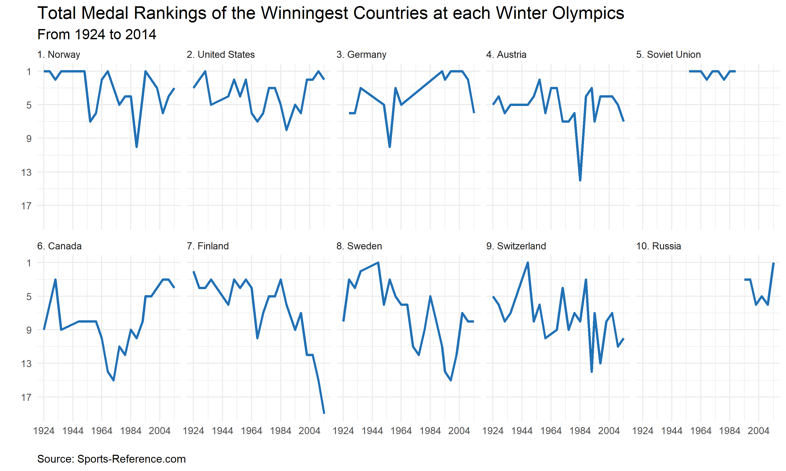

---
output:
  html_document: default
  pdf_document: default
---

{width=100%}

<h3> Makeover Monday: Feb 12, 2018 </h3>

<h3> Comments </h3>

For this week's [Makeover Monday](http://makeovermonday.co.uk/), I wanted to see how the most successful countries performed at each Winter Olympics. Just as a note, I didn't want to rely solely on medal counts because the number of medals has increased over time, so I used total medal rankings as a form of standardization. 

Overall, I think the plot is okay. It allows me to see trends pretty easily: Finland, Sweden, and Switzerland have been on a downward trend; Canada has been on a rising trend since the 1960s; and the Soviet Union was tremendously consistent during it's existence.

<h3> Code </h3>

```{r code, eval=FALSE, echo=TRUE}
# libraries ----
library(data.world)
library(dplyr)
library(ggplot2)


# data ----

# Datasets are referenced by their URL or path
dataset_key <- "https://data.world/makeovermonday/2018w7-the-winter-olympics"
# List tables available for SQL queries
tables_qry <- data.world::qry_sql("SELECT * FROM Tables")
tables_df <- data.world::query(tables_qry, dataset = dataset_key)

if (length(tables_df$tableName) > 0) {
  sample_qry <- data.world::qry_sql(sprintf("SELECT * FROM `%s`", tables_df$tableName[[1]]))
  sample_df <- data.world::query(sample_qry, dataset = dataset_key)
}


# data preparation ----

# get the top 10 medal winning countries
top_countries <- sample_df %>%
  group_by(.dots = c("country")) %>% #  "year", "gender"
  tally() %>%
  arrange(desc(n)) %>%
  top_n(10)

# will use this to update labels
top_countries$c <- paste0(1:10, ". ", top_countries$country)

# get the total medal ranking at each event for all countries
sdf <- sample_df %>%
  group_by(.dots = c("year", "country")) %>% #  "year", "gender"
  tally() %>%
  arrange(year, desc(n)) %>%
  mutate(rank = rank(n, ties.method = "max")) %>%
  mutate(max_rank = max(rank))

# subset data to only the top ten countries
data <- inner_join(sdf, top_countries %>% select(country, c))
# make ranks start at 1
data$r <- (data$max_rank - data$rank + 1) * -1

# data$country <- factor(data$country, levels = top_countries$country)
# put countries in order of all time most medals won to least medals won
data$c <- factor(data$c, levels = top_countries$c)


# plot ----
ggplot(data, aes(year, r, group = country)) + 
  geom_line(size = 1.25, alpha = 1, color = "#2171b5") +
  scale_x_continuous(name = "", breaks = seq(1924, 2014, 20)) +
  scale_y_continuous(name = "", breaks = seq(-1, -17, -4), labels = seq(1, 17, 4)) +
  ggtitle("Total Medal Rankings of the Winningest Countries at each Winter Olympics", 
          "From 1924 to 2014") +
  labs(caption = "Source: Sports-Reference.com") +
  facet_wrap(~ c, ncol = 5) +
  guides(color = FALSE) +
  theme_minimal() +
    theme(plot.title = element_text(size = 16), 
        plot.subtitle = element_text(size = 13, vjust = 0.75),
        plot.caption = element_text(hjust = 0),
        strip.text.x = element_text(hjust = 0))
```