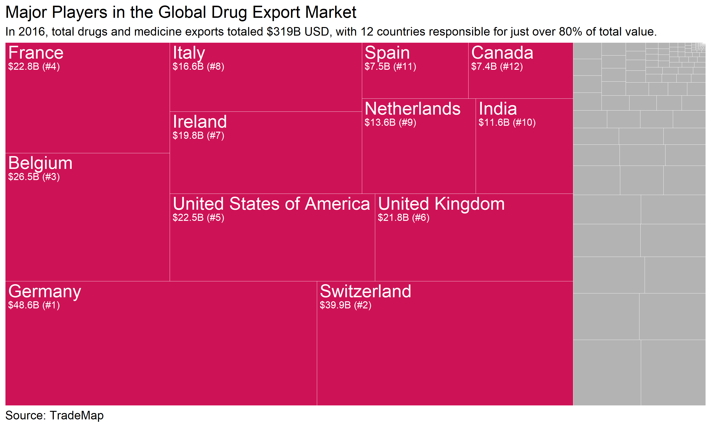

---
output:
  html_document: default
  pdf_document: default
---

{width=100%}

<h3> Makeover Monday: Feb 19, 2018 </h3>

<h3> Comments </h3>

This week's [Makeover Monday](http://makeovermonday.co.uk/) gave me a good opportunity to try out the [treemapify](https://github.com/wilkox/treemapify) package; I wanted to make a treemap similar to the one [Susan Glass](https://public.tableau.com/profile/susan.glass5813#!/vizhome/MedicineExportsbyCountry/DrugsandMedicineExports?publish=yes) created in Tableau.

Overall, I'm pleased with the plot, but it would have been nice to have annotated the plot like Susan did in her interactive viz. I really like the color text she included in the subtitle and below the treemap.

<h3> Code </h3>

```{r code, eval=FALSE, echo=TRUE}

# libraries ----
library(data.world)
library(dplyr)
library(ggplot2)
library(treemapify)


# data ----

# Datasets are referenced by their URL or path
dataset_key <- "https://data.world/makeovermonday/2018w8-where-does-your-medicine-come-from"

# List tables available for SQL queries
tables_qry <- data.world::qry_sql("SELECT * FROM Tables")
tables_df <- data.world::query(tables_qry, dataset = dataset_key)

if (length(tables_df$tableName) > 0) {
  sample_qry <- data.world::qry_sql(sprintf("SELECT * FROM `%s`", tables_df$tableName[[1]]))
  sample_df <- data.world::query(sample_qry, dataset = dataset_key)
}


# data preparation ----

# Filter 2016 data and arrange by exports USD descending
dat <- sample_df %>%
  filter(exporter != "World", year == 2016) %>%
  arrange(desc(exports_usd)) 

# top n countries and number of rows
my_top_n <- 12
nrows <- nrow(dat)

# create variable to separate top n countries from rest
dat$top_countries <- c(rep("Top", my_top_n), rep("Not", nrows-my_top_n))
# country variable will be used to label the treemap
dat$country <- dat$exporter
# remove labels for non-top n countries
dat$country[(my_top_n+1):nrows] <- ""
#  like the country variable, the usd variable will be used for labeling the treemap
dat$usd <- paste0("$", round(dat$exports_usd/1000000000, 1), "B (#", 1:nrows, ")")
# remove labels for non-top n countries
dat$usd[(my_top_n+1):nrows] <- ""


# plot ----

# treemap
ggplot(dat, aes(area = exports_usd, label = country, subgroup = top_countries)) +
  geom_treemap(aes(fill = top_countries), col = "white") +
  scale_fill_manual(values = c("Top" = "#ce1256", "Not" = "gray70")) +
  geom_treemap_text(color = "white") +
  geom_treemap_text(aes(label = usd), size = 10, color = "white", 
                    padding.y = grid::unit(7, "mm")) +
  ggtitle("Major Players in the Global Drug Export Market", 
          subtitle = "In 2016, total drugs and medicine exports totaled $319B USD, with 12 countries responsible for just over 80% of total value.") +
  labs(caption = "Source: TradeMap") +
  guides(fill = FALSE) +
  theme(plot.title = element_text(size = 17),
        plot.subtitle = element_text(size = 12),
        plot.caption = element_text(hjust = 0, size = 12))
```